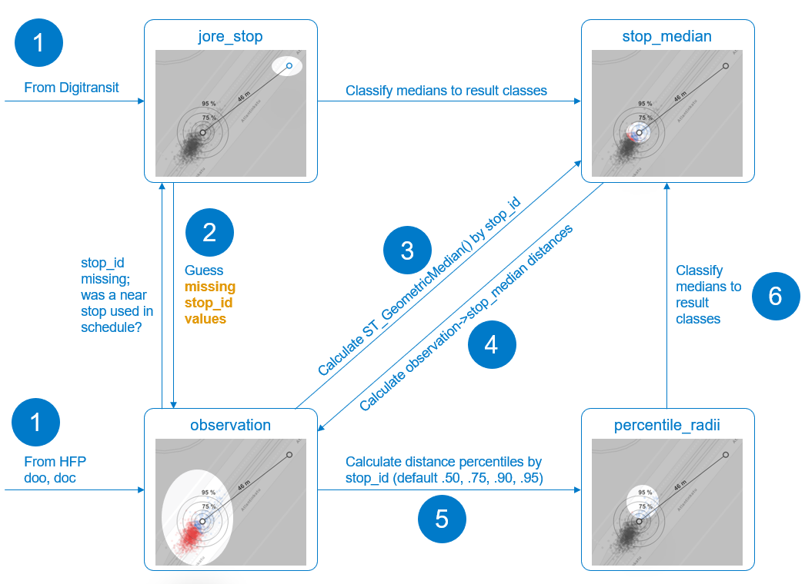

# Analysis features

## Geographical area analysis

GPS data quality can vary due to tunnels, underground terminals or other problematic areas.

- Are there geographical areas with significant quality issues, such as positioning errors or message transmission delays?
- Do the issues in an area change over time?

## Journey availability analysis _(work in progress!)_

A scheduled journey (route, dir, oday, start) exists in the HFP data, if there is at least one event from it.
Jore is considered the master data of planned _dated vehicle journeys_, HFP in turn is the master source for actually realized _monitored vehicle journeys_.

This feature tells, for a given **operating date** `yyyy-mm-dd` (and lasting over midnight),

- dated vehicle journeys planned for that date (based on Jore);
- which of these planned journeys were found in the HFP data (at least one observation from a signed-in vehicle);
- which journeys were found in HFP but have no corresponding planned journey from Jore;
- which planned journeys were realized more than once, i.e., "consumed" by multiple vehicles;
  - Were these planned journeys marked as extra journeys, in which case consumption by multiple vehicles could be OK?

### Journey stop coverage analysis

Moreover, this feature returns per-journey information on _stop coverage_, i.e., planned stop points the dated vehicle journey should have served versus actually detected stop points the monitored vehicle journey stopped at or passed.

WIP draft for this feature in the REST API:

<details>
<summary>GET /api/v1/journeys?operating_date=2022-09-01</summary>

```json
200 OK:
  {"data":
    "journeys": [
      {
        "dated_vehicle_journey_uuid": "e0f7f542-f212-4b93-a4fc-6450a145e27b",
          # ^ This is unique over route, dir, oday, start + is_extra_journey.
        "monitored_vehicle_journey_uuid": "c7122273-d75a-4b20-8588-6d1ea128d5d1", 
          # ^ Unique over route, dir, oday, start(24h), vehicle, operator; null if no match found
        "route_id": "1067",
        "direction_id": 1,
        "operating_date": "2022-09-01",
        "start_time_30h": "24:36:00",
        "is_extra_journey": False,
        "planned_stop_count": 34,
        "monitored_stop_count": 29,
        "monitored_stop_ratio": 0.8529,
        # ^ == monitored_stop_count / planned_stop_count
        "monitored_timestamp_span": {
          "start_timestamp": "20220902T003618Z",
          "end_timestamp": "20220902T011737Z"
        }, 
        # ^ Between which start and end time did we get _any_ HFP data from that journey+vehicle?
        "stops": [
          # This list contains per-stop-visit details.
          # "monitored_" entries are null if not detected.
          # Alternatively, these details could be requested
          # from a different endpoint, since this would contain a lot of data.
          {
            "stop_sequence": 1,
            "stop_role": "FIRST",
            "stop_id": "1004223",
            "planned_arrival_timestamp": "20220902T003600Z",
            "monitored_arrival_timestamp": null,
            "planned_departure_timestamp": "20220902T003600Z",
            "monitored_departure_timestamp": "20220902T003618Z",
            "detected_events": ["DOC", "PDE, "DEP"]
            # ^ The stop visit was "proven" by availability of these HFP events with correct stop value.
          },
          {
            "stop_sequence": 2,
            "stop_role": "NORMAL",
            "stop_id": "1092303",
            "planned_arrival_timestamp": "20220902T003800Z",
            "monitored_arrival_timestamp": "20220902T003811Z",
            "planned_departure_timestamp": "20220902T003800Z",
            "monitored_departure_timestamp": "20220902T003814Z",
            "detected_events": ["ARR", "PAS, "DEP"]
          },
          ...
          {
            "stop_sequence": 10,
            "stop_role": "REGULATED",
            # ^ This is a regulated timing stop where the vehicle must wait for scheduled dep time.
            "stop_id": "10921127",
            "planned_arrival_timestamp": "20220902T004900Z",
            "monitored_arrival_timestamp": "20220902T004903Z",
            "planned_departure_timestamp": "20220902T005100Z",
            "monitored_departure_timestamp": "20220902T003814Z",
            "detected_events": ["ARR", "ARS", "DOO", "DOC" "PDE, "DEP"]
          },
          {
            "stop_sequence": 11,
            "stop_role": "NORMAL",
            "stop_id": "10921127",
            "planned_arrival_timestamp": "20220902T004900Z",
            "monitored_arrival_timestamp": null,
            "planned_departure_timestamp": "20220902T005100Z",
            "monitored_departure_timestamp": null,
            "detected_events": []
            # ^ This stop was not detected in HFP.
          },
          {
            "stop_sequence": 34,
            "stop_role": "LAST",
            "stop_id": "1305597",
            "planned_arrival_timestamp": "20220902T011700Z",
            "monitored_arrival_timestamp": "20220902T011801Z",
            "planned_departure_timestamp": "20220902T011700Z",
            "monitored_departure_timestamp": null,
            "detected_events": ["ARR", "ARS", "DOO"]
          },
        ]
      }
    ]
  }
```

</details>

## Journey route validity analysis

Sometimes a vehicle serves a valid journey and route while it's signed in to a completely wrong journey with a different route.
A journey route can also be only partially fulfilled according to HFP data, or have gaps.
These could be spotted by comparing the planned Jore route geometry and actual GPS trace with `ST_FrechetDistance()`, for example.
The function returns a "similarity" value that could distinguish between *approximately* similar Jore and GPS tracks vs. those that differ significantly.

- Report journeys where the planned and actual geometry differs suspiciously much. Trigger an automatic alert and/or analyze them in more detail manually.

## Raw data availability

HFP-Analytics ingests data from flat files that are collected from the realtime API.
Data can be missing due to realtime errors or storage errors.

- Flat files by event type, their row counts, and `tst` ranges available from a given datetime range.
- Unexpected gaps in raw data availability, e.g. compared to typical row counts of the hour, day of week, and event type.
- Current data available in the HFP-Analytics db. E.g., row count by quarter hour.

## Stop correspondence analysis

This feature is used to report HSL transit stops whose geographical **position and/or stop detection radius** may require adjustments in Jore, to better reflect the real-world position and area where the vehicles stop.
This way, realtime systems are able to provide actual arrival and departure time observations of vehicles at stops as accurately as possible.
If a stop point is modeled too far away from the GPS point cloud of actual stopping locations, or if the detection radius is too small, we might get a lot of missing arr/dep times;
if the detection radius is too large, then the arrival times are often too early and departure times too late.

The analysis procedure and related tables in the `stopcorr` db schema are described below.



The analysis is made with the current stop data from Jore (via Digitransit; the same data as what's used in Reittiopas) and a sample of HFP door events.
HFP-Analytics imports the data and runs the analysis regularly.
The user can then fetch the results from the API for reporting.

> **TO DO: Reporting tutorial**.
> 
> Results are combined into a PowerPoint file that can be further distributed, modified and commented on.
> 
> The stop-HFP correspondence analysis is a one-off task run a few times per year and requires some manual effort every time.

## Vehicle analysis

HFP data quality issues are often related to faulty sensors or devices in a certain vehicle.
Therefore we'd like to monitor at least the following things by vehicle and date, for example:

- Missing or inverted door status `drst`.
- Missing or faulty odometer readings `odo`. E.g., the values may be negative, change too fast or slowly compared to real distance traveled, advance in large steps only, or reset randomly to zero.
- Amount of GPS jitter, especially when the vehicle does not move.
- Journeys that the vehicle was signed in to, and their temporal coverage (e.g., spot accidental sign-ins to a wrong journey).
- Missing or excess vehicles in HFP data, compared to Jore fleet registry:
  - Operator + vehicle id combinations in HFP but not in the registry?
  - Vehicles that haven't sent HFP messages for a long time although they should?
