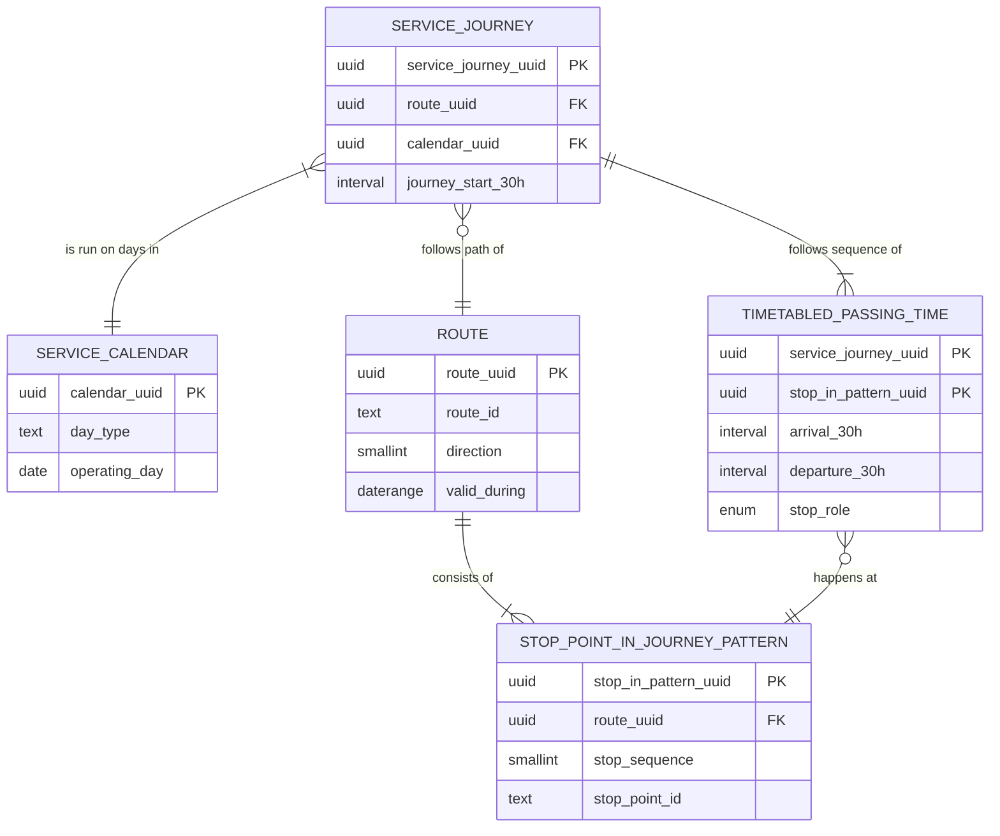
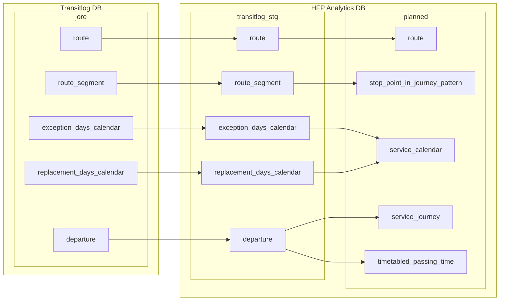

# About the data model and I/O

Thoughts behind the data model, importing, and exporting the data.
Note that this document is aspirational and may not reflect currently implemented features.

## Planned service data model

The [`planned`](../db/sql/108_planned_schema.sql) data model represents the planned transit service of HSL.
The main origin for this data is Jore (transit registry) but for a convenient integration, the data is read from Transitlog database.

In this model, we attempt to conform to [Transmodel](https://www.transmodel-cen.eu/model/index.htm) concepts and their relationships as far as conveniently possible.
Note, however, that this is far from a full implementation of Transmodel.
By following the Transmodel specification, we aim to make it easier to seamlessly change the data source for planned transit service in future, most probablt to [Jore 4.0](https://github.com/HSLdevcom/jore4).

This diagram shows the basic relations currently implemented from Transmodel.



> TODO: As a more practical example, let us consider passing times ("stop visits") of an imaginary _dated vehicle journey_, i.e., one that we except to have corresponding stop visit events in the real world, eventually seen from HFP data.
> TODO: Table here, each column originates from a relation above.

### Import flow from Transitlog DB

Data to `planned` schema is imported from [Transitlog](https://github.com/hsldevcom/transitlog-server) database's `jore` schema.
This is not a perfect solution but currently it's the easiest one to integrate to, compared to the legacy Jore production database or other solutions that usually have the route data but no schedule data available.



The above diagram shows in general how Transitlog `jore` entities flow into destination tables in HFP Analytics.

- The data is read daily by default. A 2-week range `date1..date2` is defined for the read batch: this should correspond to the period from which we have HFP data in HFP Analytics DB. The batch reading and insertion process is handled by a Python service.
- Only those entities whose validity period intersects with `date1..date2`, e.g. by `date_begin` and `date_end` values, is included in the batch.
- The batch is inserted into staging tables in [`transitlog_stg` schema](../db/sql/1081_transitlog_staging_schema.sql). Any existing data is deleted from this schema in the beginning of each import run.
- Finally, functions in `transitlog_stg` schema transform and insert the data into `planned` tables. For some entities, this mostly means generating UUID keys (as opposed to compound primary keys in Transitlog DB) and using Transmodel-compatible entity names, but there are also some special actions to consider:
  - Transitlog DB can include route versions whose validity date ranges overlap, which is not allowed in HFP Analytics. This is probably because Jore data is updated to Transitlog incrementally on a daily basis, and old route versions may be left untouched while they were actually updated in Jore. We currently resolve this by keeping only the most recent ones of overlapping route versions, by Jore modification date and secondarily by Transitlog import time. 
  - Jore's _exception_ and _replacement_ days are translated into a simple service calendar that maps day types to calendar dates.
  - Transitlog does not have an entity comparable to _journey_, but it can be derived by picking each `departure` entity that happens at the first stop of the journey.
  - `departure` entities are translated into `timetabled_passing_time`s, but their journey-related attributes (such as day type) are normalized into `service_journey`.

In future, we probably want to use [Jore4](https://github.com/hsldevcom/jore4) as a data source instead of Transitlog DB.
`planned` schema follows Transmodel concepts to make this transition easier.
After the transition, Transitlog DB and `transitlog_stg` schema are no longer needed in the architecture of HFP Analytics.

## HFP data model

The `hfp` schema in the database essentially answers the question **what was the state of vehicle X at this given second Y**.
This state includes information very familiar from real-time HFP: geographical position of the vehicle, door status, odometer, possible service journey that the vehicle was signed in to, and so on.

### Merging event messages of vehicle + full second

Unlike in real-time HFP where different event types are available as separate messages, here the **events are part of the vehicle state during a full UTC second**.

Original HFP data is merged to per-second rows like so (normalisation into vehicle and journey tables ignored here):

```
# DATA IMPORTED:
| vehicle_id | tst                      | event_type  | drst  | ...
| 2201219    | 2022-05-16T16:45:02.462Z | VP          | true  | ... <- imported first in order
| 2201219    | 2022-05-16T16:45:02.731Z | DOC         | false | ...
| 2201219    | 2022-05-16T16:45:02.904Z | PDE         | false | ...
| 2201219    | 2022-05-16T16:45:03.012Z | VP          | false | ...
| 2201219    | 2022-05-16T16:45:04.124Z | VP          | false | ...

# AFTER IMPORT IN DATABASE:
| vehicle_id | event_timestamp          | event_types | drst  | ...
| 2201219    | 2022-05-16T16:45:02.000Z | VP,DOC,PDE  | true  | ...
| 2201219    | 2022-05-16T16:45:03.000Z | VP          | false | ...
| 2201219    | 2022-05-16T16:45:04.000Z | VP          | false | ...
```

So, while real-time HFP data is a mix of state and event data, in a way, for our data model we make it into state-only data.

By merging separate event messages of the same vehicle and second into one row, we achieve:

- A clear data model that represents the vehicle state at the precision of a full second.
- A smaller amount of rows in the database.
- Less repetitive and redundant data: for business point of view, it is not meaningful to compare events at less than 1 s precision, since the timestamp and position information in HFP is inherently a bit unreliable due to network lags, GPS and device errors.
  - E.g., coordinates of a vehicle are not expected to change _significantly_ between HFP messages less than a second apart.
- A clear basis for filtering and aggregating vehicle state data, e.g. "give me a linestring path of the actual journey path" without having to query `VP` events only.

On the other hand, there are tradeoffs and assumptions to remember:

- Merging events of the same second+vehicle potentially leads to lost information. Say, we have `VP`, `PDE`, and `DOC` events of the same full second; `VP` with `drst = TRUE` is inserted first, the two other events thereafter; now, if in `DOC` we had `drst = FALSE`, this would be in conflict with the `VP` event but still the door status of the original `VP` event would be considered as "fact" in the eventual data.
  - For this reason, the data model does not allow for monitoring potentially inconsistent state behaviour of events within the same second. If this is considered an important requirement, the data model has to be changed, or consistency of the original events has to be checked upon importing them to the database.
- At the moment, whichever event message is inserted first becomes the "seed" of the state information for that second+vehicle. We have currently no way to choose the "best" representative one from multiple events for a second+vehicle, in terms of data quality. It is possible that a `VP` event has nonsense coordinates while a `DOO` event 50 ms after it would have perfectly valid coordinates.
- The full-second `event_timestamp` is generated by truncating ("flooring") the original `tst` value to integer second precision. So, a timestamp like `...T10:04:03.999Z` would become `...T10:04:03Z`, which can affect time-/position-related calculations when compared to original HFP data.
  - Still, this is needed to be able to group events of same second+vehicle to one state row in the first place. Like mentioned, < 1 s precision is not considered significant in our case.
  - Truncating manipulates timestamps but does it in the same, consistent way for every value, so the overall error is rather marginal.
  - This is effectively the same as using `tsi` as the source for time information.

### Normalized data model

HFP data in the database is split into three tables:

```
hfp.vehicle <-- hfp.hfp_point --> hfp.observed_journey
```

The model aims to minimal repetition of values in the `hfp_point` table that has potentially hundreds of millions of rows.

`vehicle` is a **required** part of a `hfp_point`: a vehicle and a timestamp uniquely define an observation.

`observed_journey` is an **optional** part of a `hfp_point`: `journey_id` is only available **if the vehicle was signed in to a service journey** at that second.
As long as we only import `ongoing = TRUE` messages to the database, `journey_id` is generally available on every row, though.

Vehicle and journey keys are generated *deterministically*: integer `vehicle_id` depends on operator and vehicle number, uuid `journey_id` depends on journey attributes.
This way the same vehicle or same journey cannot be accidentally saved twice, although this could be enforced with unique constraints too.
But moreover, deterministic ids can be created the same way outside this database as well.

### About journeys in HFP

`hfp.observed_journey` basically means a *scheduled / planned / ordered journey* that was *observed in the HFP data*.
Meanwhile, we can define some other types of journeys too:

- *Scheduled journey* like we have planned and dated journeys originally in Jore. 
  - Some of the planned journeys in Jore can be missing from HFP: this can be due to actually cancelled journeys or loss of data. Based on HFP data alone, we don't know.
  - Conversely, HFP can include journeys not found in Jore, and it is indeed relevant to investigate why this happens.
- *Actual, realized journey* that was really driven by a real vehicle. In our data model, this would be a set of `hfp_point` observations of a vehicle sharing the same `journey_id`, ordered by `event_timestamp`. 
  - Note that the same *scheduled journey* can be "consumed" by multiple vehicles if they signed in to the same journey in LIJ, whether it be on purpose or not.

## Importing HFP data

HFP data is imported into the database in raw format where only the columns need to be selected, named and ordered correctly for the db;
other transformations are done by the database.
This is implemented with a **view** against which the data is imported, and an `INSTEAD OF INSERT` trigger function that distributes the imported rows to `hfp_point`, `vehicle`, and `observed_journey` tables, ignores inserts where a row with the primary key values already exists in these tables, and does the aforementioned merging of imported rows for `hfp_point` table.

This implementation causes some more logic on the db side, and SQL code that is potentially difficult to debug.
However, this way the heavy-lifting of data is left to the most efficient environment - the database - so we do not need query data back and forth between db and Python or loop over rows in Python.
